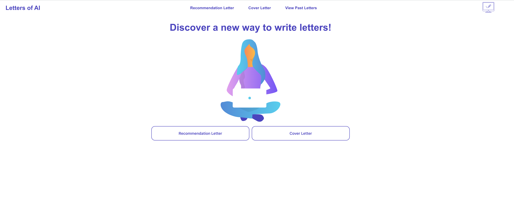

<div align="center">
  <!-- <a href="https://github.com/github_username/repo_name">
    
  </a> -->

<h1 align="center">Letters of AI</h1>

  <p align="center">
   TLDR: This tool allows you to input a linkedin job URL and a couple of traits about yourself or a candidate, and the tool will generate a cover letter or letter of rec for you that you can copy or save.
    <br />
    <br />
<!--     <a href="https://youtube.com"><strong>View Product Video Demo</strong></a> -->
    
    <a href="https://lettersofai.onrender.com/"><strong>Live Site</strong></a>
  </p>
</div>

## About The Project

<br />

<p align="center">
  
</p>

### Background and Motivation

Countless users already use OpenAI's chat interface (ChatGPT( to handle all sorts of routine tasks: write emails, answer research questions, debug code, etc. While extremely powerful, the ChatBot still requires users to overcome to pain points:

- Identify which problems ChatGPT would well: \* AI has a unique advantage over humans in handling issues that require exposure to vast data sets (e.g. image labeling) or repetitive tasks prone to error. But would you trust it to write you a love letter? The optimal task division between humans and AI is still evolving, leaving it up to individuals to decide when to handle a task themselves as opposed to rely on a machine.

- Formulate the prompt to ask ChatGPT: Even if a user knows that a certain task is better suited for AI than humans, s/he must then identify the best way to pose a query and present relevant data to the AI.

With the release of ChatGPT's API, developers can leave the nitty-gritty details of model development to OpenAI and focus on building tools that optimize for user experience. We anticipate that these tools will focus on specific use cases and be discovered by users looking for a solution to a problem they didn't even know AI could solve. They will then simplify the process of data collection from users to ensure that the AI is fed the optimal parameters to produce quality results.

As part of our efforts to predict the types of applications we expect to be built off of ChatGPT's API, we wanted to understand how difficult it was to build a ChatGPT integrated tool. So we built a little example ourselves!

### How It's Made

**Technologies Used:**

- <strong>React</strong>
- <strong>JavaScript</strong>
- <strong>ChatGPT API Integration</strong>: Users can input a couple of fields about a job they are applying to or recommending a candidate for, which generates a prompt that ChatGPT can complete
- <strong>Pupeteer/Chromium Integration</strong>: Users can put in a link to any LinkedIn Job Description, and the tool parses the page to extract the job description
- <strong>Public Hosting</strong>: Using Render and Glitch, we were able to publicly host the server that returns the ChatGPT + Pupeteer responses, as well as our db.json. This allows our tool to be accessed by users without access to our localhost server.

## Getting Started

**Installation**

```
npm install
```

**Usage**

```
npm start
```

Runs the app in the development mode.\
Open [http://localhost:3000](http://localhost:3000) to view it in your browser.
